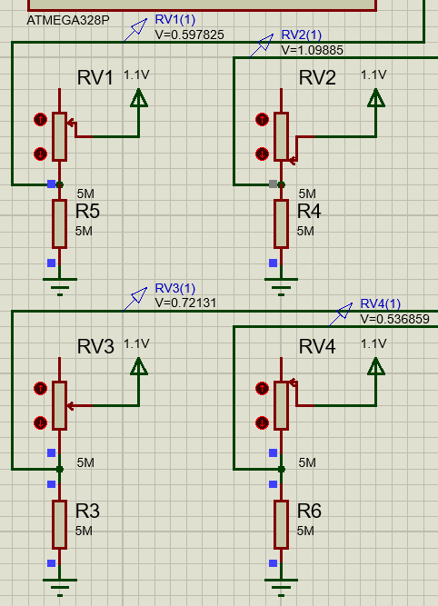
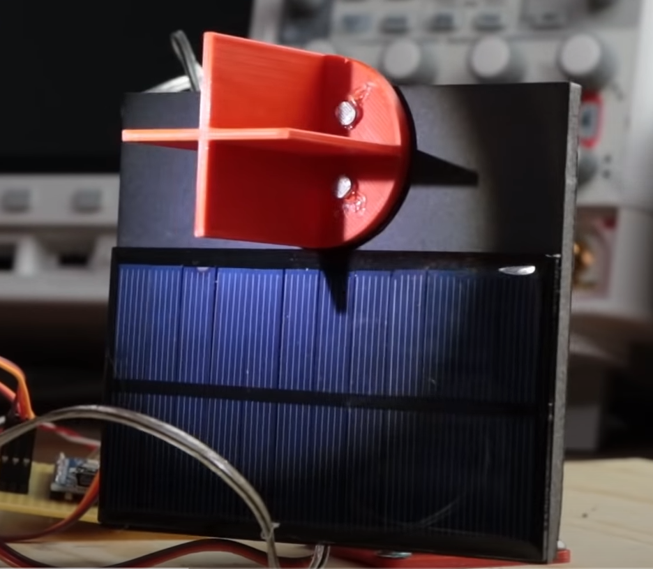
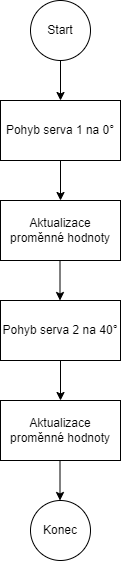

# Weather station with 2-axis solar tracking system

### Team members

* Šimon Roubal 
* Petr Medek 
* Jakub Socha 
* Ondřej Ryšavý 


Link to this file in your GitHub repository:

[https://github.com/Simon-Roubal/Meteo-station](https://github.com/Simon-Roubal/Meteo-station)

### Table of contents

* [Project objectives](#objectives)
* [Hardware description](#hardware)
* [Libraries description](#libs)
* [Main application](#main)
* [Video](#video)
* [References](#references)

<a name="objectives"></a>

## Project objectives

The goal of the project is to develop a weather station with 2-axis solar panel tracking using various sensors and servos. The project will be based on an Arduino UNO board with an Atmega328p microcontroller and written in C language.

<a name="hardware"></a>

## Hardware description


The basic of the whole hardware is the Arduino UNO board with an Atmega328p microcontroller. Three types of sensors are connected to this board. Temperature sensor [TMP36](https://www.analog.com/media/en/technical-documentation/data-sheets/TMP35_36_37.pdf), humidity sensor [HIH5030](https://sensing.honeywell.com/honeywell-sensing-hih5030-5031-series-product-sheet-009050-2-en.pdf) and four pieces of [photoresistors](https://dratek.cz/arduino/1073-fotorezistor-5mm-gl5539.html). There are also two servo motors that serve in combination with photoresistors to move a solar panel and follow the sun. For showing information about temperature and humidity is here LCD display [LM016L](https://www.datasheet-pdf.info/entry/LM016L).


HIH5030 is connected to the board through a voltage divider because of output voltage would not be higher than a reference voltage. (1.1V).

 

The function of moving solar panel works on the principle four photo elements (in our case photoresistors), which are separated with some light barrier. Photoresistors are connected in a voltage divider. The output voltage of this divider says how much light intensity is on photoresistors at the moment. If the voltage on every photoresistor, with some deviation, is the same then is panel turned to the sun.

Condition for the first installation: In the first installation user must turn the panel to the sun.

In the case of simulation, the photoresistors were replaced by potentiometers.

 

Principle of solar sensor in practice: [https://www.youtube.com/watch?v=_6QIutZfsFs](https://www.youtube.com/watch?v=_6QIutZfsFs)



<a name="libs"></a>

## Libraries description

Two of the libraries were used for DE2 laboratory lessons:
[https://github.com/tomas-fryza/Digital-electronics-2/tree/master/Labs/library](https://github.com/tomas-fryza/Digital-electronics-2/tree/master/Labs/library)

 - lcd 
 - timer


Then here is one library made for spinning PWM servo motors. Functions in this library will say to the servo motor to which angle it has to move. It includes 19 functions for angles from -90° to +90°. 

Example of function for +90°:
```c
void servo_move_plus_ninety(volatile uint8_t *reg_name, volatile uint8_t *port_name, uint8_t pin_num)
{
	uint16_t x = 1250;
	uint16_t y = 20000-x;
	*reg_name = *reg_name | (1<<pin_num);
	*port_name = *port_name & ~(1<<pin_num);
	*port_name = *port_name |(1<<pin_num);
	_delay_us(x);
	*port_name = *port_name & ~(1<<pin_num);
	_delay_us(y);
}
```
The value of variable x is the value of pulse width which controls rotation level.

<a name="main"></a>

## Main application




<a name="video"></a>

## Video

Write your text here

<a name="video"></a>

## References

libraries: [https://github.com/tomas-fryza/Digital-electronics-2/tree/master/Labs/library](https://github.com/tomas-fryza/Digital-electronics-2/tree/master/Labs/library)

TMP36: [https://www.analog.com/media/en/technical-documentation/data-sheets/TMP35_36_37.pdf](https://www.analog.com/media/en/technical-documentation/data-sheets/TMP35_36_37.pdf)

HIH5030: [https://sensing.honeywell.com/honeywell-sensing-hih5030-5031-series-product-sheet-009050-2-en.pdf](https://sensing.honeywell.com/honeywell-sensing-hih5030-5031-series-product-sheet-009050-2-en.pdf)

photoresistors: [https://dratek.cz/arduino/1073-fotorezistor-5mm-gl5539.html](https://dratek.cz/arduino/1073-fotorezistor-5mm-gl5539.html)

LM016L: [https://www.datasheet-pdf.info/entry/LM016L](https://www.datasheet-pdf.info/entry/LM016L)

Principle of solar sensor in practice: [https://www.youtube.com/watch?v=_6QIutZfsFs](https://www.youtube.com/watch?v=_6QIutZfsFs)

<a name="references"></a>
